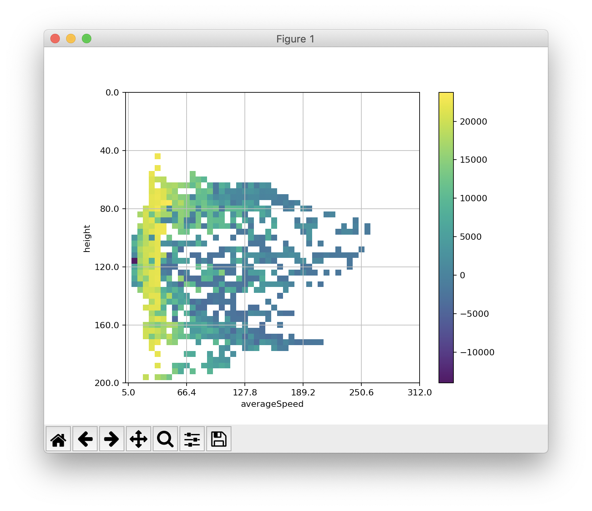

# CaveSwingWorkshop


The CaveSwing implementation is taken from https://github.com/ljialin/SimpleAsteroids.

## installation
Python dependencies (It is recommended to create a virtual environment for the project):
- thrift
- numpy
- matplotlib
- python-opencv

optionally: Jupiter notebook, but can work without it

Java
- version 8
- additional libraries are in the lib subfolder

## running Map-elites
The main files for tuning the parameters in CaveSwing can be found in the src/hyperopt package. It contains both python and Java code.

To run the project the following steps should be followed:
- 1, run main in ```TuneMapElites.java```, which starts up the server.
- 2, run either the ```map_elites.ipnyb``` or ```mapElite.py```

You can modify, which behaviour descriptors you want to use.
It is also possibile to add new descriptors, which has to be done on the Java side in the ```TuneMapElites.java```, where the descriptors are added to the ```Results``` object.

## Initialize MAP-elites

Define the threshold for the bins, which should be the minimum and maximum values of the expected behaviour characterization values.
```python
mapElite.behaviour_tresholds = [
    ("height", (mapElite.get_threshold(min=0, max=200, bins=50))),
    ("averageSpeed", (mapElite.get_threshold(min=5., max=312., bins=50)))]
```

Connect to the Java client (should run ```TuneMapElites.java``` first) and run the ```numIters``` of iterations with G random initial solutions. After running G random parameters the remaining iterations mutates the found parameters to find new ones.
```python
client = mapElite.connectToServer()
    elites = mapElite.runSimulation(numIters, randomSolutions, client)
```

Visualize the found solutions as a heatmap. 
```python
mapElite.makeHeatMap(elites)
```
After running for 2000 iterations, we should get a heatmap similar to this. For running longer more bins should be filled up by the algorithms.
